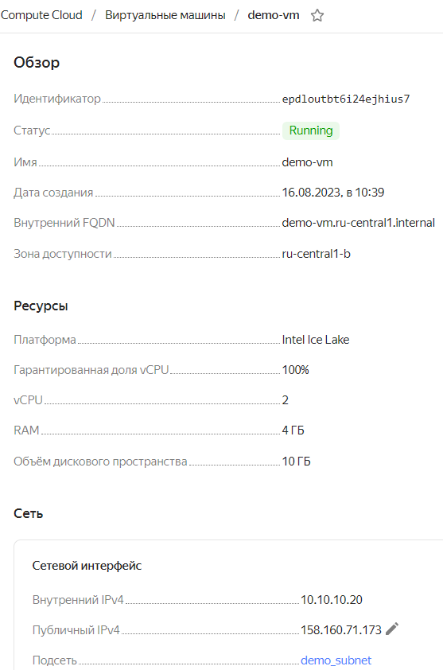
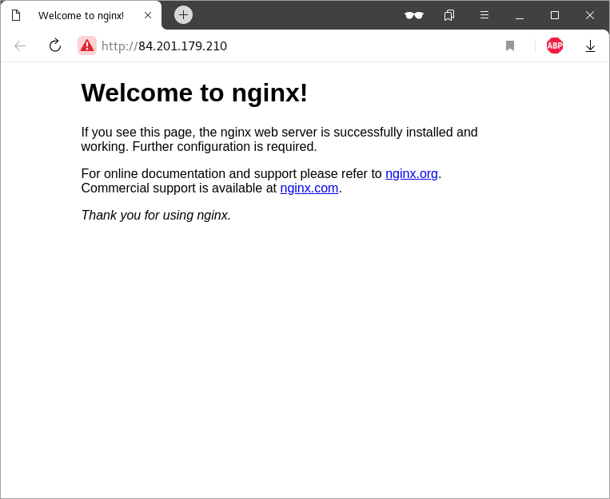

## lab-01
otus | first terraform script

### Домашнее задание
первый терраформ скрипт

#### Цель:
реализовать первый терраформ скрипт.

#### Описание/Пошаговая инструкция выполнения домашнего задания:
##### Необходимо:
1. реализовать терраформ для разворачивания одной виртуалки в yandex-cloud
2. запровиженить nginx с помощью ansible

#### Формат сдачи
- репозиторий с терраформ манифестами
- README файл

#### Критерии оценки:
преподаватель с помощью terraform apply должен получить развернутый стенд

### Выполнение домашнего задания

#### Создание стенда

Получаем OAUTH токен:
```
https://cloud.yandex.ru/docs/iam/concepts/authorization/oauth-token
```
Настраиваем аутентификации в консоли:
```
export YC_TOKEN=$(yc iam create-token)
export TF_VAR_yc_token=$YC_TOKEN
```

Создадим директорий lab-01 и перейдём в него:
```
mkdir ./lab-01 && cd ./lab-01/
```
Создадим необходимые файлы:
provider.tf:
```
locals {
  cloud_id           = "b1gk2uh1jv4i27fikj4f"
  folder_id          = "b1g5h8d28qvg63eps3ms" #otus-lab
  zone               = "ru-central1-b"
}

terraform {
  required_providers {
    yandex = {
      source = "yandex-cloud/yandex"
    }
  }
}

provider "yandex" {
  cloud_id  = local.cloud_id
  folder_id = local.folder_id
}
```

variables.tf:
```
variable "vpc_name" {
  type = string
  description = "VPC name"
}

variable "zone" {
  type = string
  default = "ru-central1-b"
  description = "zone"
}

variable "subnet_name" {
  type = string
  description = "subnet name"
}

variable "subnet_cidrs" {
  type = list(string)
  description = "CIDRs"
}

## VM parameters
variable "vm_name" {
  description = "VM name"
  type        = string
}

variable "cpu" {
  description = "VM CPU count"
  default     = 2
  type        = number
}

variable "memory" {
  description = "VM RAM size"
  default     = 4
  type        = number
}

variable "core_fraction" {
  description = "Core fraction, default 100%"
  default     = 100
  type        = number
}

variable "disk" {
  description = "VM Disk size"
  default     = 10
  type        = number
}

variable "image_id" {
  description = "Default image ID Debian 11"
  default     = "fd83u9thmahrv9lgedrk" # debian-11-v20230814
  type        = string
}

variable "nat" {
  type    = bool
  default = true
}

variable "platform_id" {
  type    = string
  default = "standard-v3"
}

variable "internal_ip_address" {
  type    = string
  default = null
}

variable "nat_ip_address" {
  type    = string
  default = null
}

variable "disk_type" {
  description = "Disk type"
  type        = string
  default     = "network-ssd"
}

variable "ssh_key" {
  type        = string
  description = "cloud-config ssh key"
  default = ""
}
```

main.tf:
```
locals {
  ssh_key = "user:${file("~/.ssh/id_rsa.pub")}"
}

resource "yandex_vpc_network" "vpc" {
  # folder_id = var.folder_id
  name = var.vpc_name
}

resource "yandex_vpc_subnet" "subnet" {
  # folder_id = var.folder_id
  v4_cidr_blocks = var.subnet_cidrs
  zone           = var.zone
  name           = var.subnet_name
  network_id = yandex_vpc_network.vpc.id
}

resource "yandex_compute_instance" "instance" {
  name        = var.vm_name
  hostname    = var.vm_name
  platform_id = var.platform_id
  zone        = var.zone
  # folder_id   = var.folder_id
  resources {
    cores         = var.cpu
    memory        = var.memory
    core_fraction = var.core_fraction
  }

  boot_disk {
    initialize_params {
      image_id = var.image_id
      size     = var.disk
      type     = var.disk_type
    }
  }

  network_interface {
    subnet_id          = yandex_vpc_subnet.subnet.id
    nat                = var.nat
    ip_address         = var.internal_ip_address
    nat_ip_address     = var.nat_ip_address
  }

  metadata = {
    ssh-keys           = local.ssh_key
  }
}
```
input.auto.tfvars:
```
vpc_name = "demo_vpc"
subnet_name = "demo_subnet"
subnet_cidrs = [ "10.10.10.0/24" ]

vm_name = "demo-vm"
```
Для инициализации проекта запустим команду:
```
terraform init
```
```
Initializing the backend...

Initializing provider plugins...
- Finding latest version of yandex-cloud/yandex...
- Installing yandex-cloud/yandex v0.96.1...
- Installed yandex-cloud/yandex v0.96.1 (unauthenticated)

Terraform has created a lock file .terraform.lock.hcl to record the provider
selections it made above. Include this file in your version control repository
so that Terraform can guarantee to make the same selections by default when
you run "terraform init" in the future.

╷
│ Warning: Incomplete lock file information for providers
│ 
│ Due to your customized provider installation methods, Terraform was forced to calculate lock file checksums locally for the
│ following providers:
│   - yandex-cloud/yandex
│ 
│ The current .terraform.lock.hcl file only includes checksums for linux_amd64, so Terraform running on another platform will fail to
│ install these providers.
│ 
│ To calculate additional checksums for another platform, run:
│   terraform providers lock -platform=linux_amd64
│ (where linux_amd64 is the platform to generate)
╵

Terraform has been successfully initialized!

You may now begin working with Terraform. Try running "terraform plan" to see
any changes that are required for your infrastructure. All Terraform commands
should now work.

If you ever set or change modules or backend configuration for Terraform,
rerun this command to reinitialize your working directory. If you forget, other
commands will detect it and remind you to do so if necessary.
```
Проверим на корректность синтаксиса написания:
```
terraform validate
```
```
Success! The configuration is valid.
```

Следующей командой увидим план предстоящего выполнения проекта:
```
terraform plan
```
Получим следующее:
```
Terraform used the selected providers to generate the following execution plan. Resource actions are indicated with the following
symbols:
  + create

Terraform will perform the following actions:

  # yandex_compute_instance.instance will be created
  + resource "yandex_compute_instance" "instance" {
      + created_at                = (known after apply)
      + folder_id                 = (known after apply)
      + fqdn                      = (known after apply)
      + gpu_cluster_id            = (known after apply)
      + hostname                  = "demo-vm"
      + id                        = (known after apply)
      + metadata                  = {
          + "ssh-keys" = <<-EOT
                user:ssh-rsa AAAAB3NzaC1yc2EAAAADAQABAAACAQDOhoQz97bl8n/F/QyM1OiqgrdA4ClCRVKBAZGDHtAF31UlrM+OQ6d33yhlDUMfMyzubeXGt0yeiRaPYEDPe41Pa3EkDd8S2tRtgMfu2iSO6QeYiwQRhPmbJQNLDfLD0GI0UOVw76KjxxA6iTNon5wvgeZfEzcNHP/OluYrtdPYuYmSrSMSO9xaXyWvkZgwDsNQPJYf2PhxPgCkVwNyBA64NVEKsUqpC6RWpxC2GTknq8cgBp5/lJr+Z7b6bTnP39tUSd4ansaXGJ960B+lS/AuZA7TpGFaq1NWycPBBt24DAGvWMWcTfEuByT+uXLHYd7J018lfSL2HL9TE3wEmnFEnkpTxqU9Jih4ToYcE6533fy2+TjIsGwszUb/x4TVRgrUFmtjRyYYc3rKFQrh9dncQBm6cAbB35bTtBysnYAspDQdGtcD4ULOBn30bWPxV1wj8lXjTxrG3K3qEK5TVPB01ITdnp9Kd7gaouMg44t6sOIlKybBUtn88/D1hhtiWRTXdZX3qheHvubrF76AkAJ0VolIidGTX0++TrR5qqjEkrsSAa4nNVmr47NZjDYRxW/twCK71eRm+cYwYDnnAXVf4pmjANebCrQ+zEvu/dPil0XVCUPHXY2I2O/mjmpDJkz16f6dlbY1jo/Vhh69IMOJ0KsWBQwsv6oMHZNKYHmNiQ== user@redos.localdomain
            EOT
        }
      + name                      = "demo-vm"
      + network_acceleration_type = "standard"
      + platform_id               = "standard-v3"
      + service_account_id        = (known after apply)
      + status                    = (known after apply)
      + zone                      = "ru-central1-b"

      + boot_disk {
          + auto_delete = true
          + device_name = (known after apply)
          + disk_id     = (known after apply)
          + mode        = (known after apply)

          + initialize_params {
              + block_size  = (known after apply)
              + description = (known after apply)
              + image_id    = "fd83u9thmahrv9lgedrk"
              + name        = (known after apply)
              + size        = 10
              + snapshot_id = (known after apply)
              + type        = "network-ssd"
            }
        }

      + metadata_options {
          + aws_v1_http_endpoint = (known after apply)
          + aws_v1_http_token    = (known after apply)
          + gce_http_endpoint    = (known after apply)
          + gce_http_token       = (known after apply)
        }

      + network_interface {
          + index              = (known after apply)
          + ip_address         = (known after apply)
          + ipv4               = true
          + ipv6               = (known after apply)
          + ipv6_address       = (known after apply)
          + mac_address        = (known after apply)
          + nat                = true
          + nat_ip_address     = (known after apply)
          + nat_ip_version     = (known after apply)
          + security_group_ids = (known after apply)
          + subnet_id          = (known after apply)
        }

      + placement_policy {
          + host_affinity_rules = (known after apply)
          + placement_group_id  = (known after apply)
        }

      + resources {
          + core_fraction = 100
          + cores         = 2
          + memory        = 4
        }

      + scheduling_policy {
          + preemptible = (known after apply)
        }
    }

  # yandex_vpc_network.vpc will be created
  + resource "yandex_vpc_network" "vpc" {
      + created_at                = (known after apply)
      + default_security_group_id = (known after apply)
      + folder_id                 = (known after apply)
      + id                        = (known after apply)
      + labels                    = (known after apply)
      + name                      = "demo_vpc"
      + subnet_ids                = (known after apply)
    }

  # yandex_vpc_subnet.subnet will be created
  + resource "yandex_vpc_subnet" "subnet" {
      + created_at     = (known after apply)
      + folder_id      = (known after apply)
      + id             = (known after apply)
      + labels         = (known after apply)
      + name           = "demo_subnet"
      + network_id     = (known after apply)
      + v4_cidr_blocks = [
          + "10.10.10.0/24",
        ]
      + v6_cidr_blocks = (known after apply)
      + zone           = "ru-central1-b"
    }

Plan: 3 to add, 0 to change, 0 to destroy.

──────────────────────────────────────────────────────────────────────────────────────────────────────────────────────────────────────

Note: You didn't use the -out option to save this plan, so Terraform can't guarantee to take exactly these actions if you run
"terraform apply" now.
```
Теперь выполним проект с помощью следующей команды:
```
terraform apply
```
```
Terraform used the selected providers to generate the following execution plan. Resource actions are indicated with the following
symbols:
  + create

Terraform will perform the following actions:

  # yandex_compute_instance.instance will be created
  + resource "yandex_compute_instance" "instance" {
      + created_at                = (known after apply)
      + folder_id                 = (known after apply)
      + fqdn                      = (known after apply)
      + gpu_cluster_id            = (known after apply)
      + hostname                  = "demo-vm"
      + id                        = (known after apply)
      + metadata                  = {
          + "ssh-keys" = <<-EOT
                user:ssh-rsa AAAAB3NzaC1yc2EAAAADAQABAAACAQDOhoQz97bl8n/F/QyM1OiqgrdA4ClCRVKBAZGDHtAF31UlrM+OQ6d33yhlDUMfMyzubeXGt0yeiRaPYEDPe41Pa3EkDd8S2tRtgMfu2iSO6QeYiwQRhPmbJQNLDfLD0GI0UOVw76KjxxA6iTNon5wvgeZfEzcNHP/OluYrtdPYuYmSrSMSO9xaXyWvkZgwDsNQPJYf2PhxPgCkVwNyBA64NVEKsUqpC6RWpxC2GTknq8cgBp5/lJr+Z7b6bTnP39tUSd4ansaXGJ960B+lS/AuZA7TpGFaq1NWycPBBt24DAGvWMWcTfEuByT+uXLHYd7J018lfSL2HL9TE3wEmnFEnkpTxqU9Jih4ToYcE6533fy2+TjIsGwszUb/x4TVRgrUFmtjRyYYc3rKFQrh9dncQBm6cAbB35bTtBysnYAspDQdGtcD4ULOBn30bWPxV1wj8lXjTxrG3K3qEK5TVPB01ITdnp9Kd7gaouMg44t6sOIlKybBUtn88/D1hhtiWRTXdZX3qheHvubrF76AkAJ0VolIidGTX0++TrR5qqjEkrsSAa4nNVmr47NZjDYRxW/twCK71eRm+cYwYDnnAXVf4pmjANebCrQ+zEvu/dPil0XVCUPHXY2I2O/mjmpDJkz16f6dlbY1jo/Vhh69IMOJ0KsWBQwsv6oMHZNKYHmNiQ== user@redos.localdomain
            EOT
        }
      + name                      = "demo-vm"
      + network_acceleration_type = "standard"
      + platform_id               = "standard-v3"
      + service_account_id        = (known after apply)
      + status                    = (known after apply)
      + zone                      = "ru-central1-b"

      + boot_disk {
          + auto_delete = true
          + device_name = (known after apply)
          + disk_id     = (known after apply)
          + mode        = (known after apply)

          + initialize_params {
              + block_size  = (known after apply)
              + description = (known after apply)
              + image_id    = "fd83u9thmahrv9lgedrk"
              + name        = (known after apply)
              + size        = 10
              + snapshot_id = (known after apply)
              + type        = "network-ssd"
            }
        }

      + metadata_options {
          + aws_v1_http_endpoint = (known after apply)
          + aws_v1_http_token    = (known after apply)
          + gce_http_endpoint    = (known after apply)
          + gce_http_token       = (known after apply)
        }

      + network_interface {
          + index              = (known after apply)
          + ip_address         = (known after apply)
          + ipv4               = true
          + ipv6               = (known after apply)
          + ipv6_address       = (known after apply)
          + mac_address        = (known after apply)
          + nat                = true
          + nat_ip_address     = (known after apply)
          + nat_ip_version     = (known after apply)
          + security_group_ids = (known after apply)
          + subnet_id          = (known after apply)
        }

      + placement_policy {
          + host_affinity_rules = (known after apply)
          + placement_group_id  = (known after apply)
        }

      + resources {
          + core_fraction = 100
          + cores         = 2
          + memory        = 4
        }

      + scheduling_policy {
          + preemptible = (known after apply)
        }
    }

  # yandex_vpc_network.vpc will be created
  + resource "yandex_vpc_network" "vpc" {
      + created_at                = (known after apply)
      + default_security_group_id = (known after apply)
      + folder_id                 = (known after apply)
      + id                        = (known after apply)
      + labels                    = (known after apply)
      + name                      = "demo_vpc"
      + subnet_ids                = (known after apply)
    }

  # yandex_vpc_subnet.subnet will be created
  + resource "yandex_vpc_subnet" "subnet" {
      + created_at     = (known after apply)
      + folder_id      = (known after apply)
      + id             = (known after apply)
      + labels         = (known after apply)
      + name           = "demo_subnet"
      + network_id     = (known after apply)
      + v4_cidr_blocks = [
          + "10.10.10.0/24",
        ]
      + v6_cidr_blocks = (known after apply)
      + zone           = "ru-central1-b"
    }

Plan: 3 to add, 0 to change, 0 to destroy.

Do you want to perform these actions?
  Terraform will perform the actions described above.
  Only 'yes' will be accepted to approve.

  Enter a value: 
```
Как видим, команда сделала такой же вывод как и terraform plan, затем набираем 'yes' и нажимаем enter:
```
  Enter a value: yes

yandex_vpc_network.vpc: Creating...
yandex_vpc_network.vpc: Creation complete after 1s [id=enpp6f08k9jo6vum6qre]
yandex_vpc_subnet.subnet: Creating...
yandex_vpc_subnet.subnet: Creation complete after 1s [id=e2lml1vmag3fb7kuf2tg]
yandex_compute_instance.instance: Creating...
yandex_compute_instance.instance: Still creating... [10s elapsed]
yandex_compute_instance.instance: Still creating... [20s elapsed]
yandex_compute_instance.instance: Still creating... [30s elapsed]
yandex_compute_instance.instance: Still creating... [40s elapsed]
yandex_compute_instance.instance: Creation complete after 43s [id=epdloutbt6i24ejhius7]

Apply complete! Resources: 3 added, 0 changed, 0 destroyed.
```
Как видим, было создано три ресурса: внешняя и внутренняя сети и сама виртаульная машина.



Удалим полностью все созданные ресурсы с помощью команды:
```
terraform destroy
```
```
yandex_vpc_network.vpc: Refreshing state... [id=enpp6f08k9jo6vum6qre]
yandex_vpc_subnet.subnet: Refreshing state... [id=e2lml1vmag3fb7kuf2tg]
yandex_compute_instance.instance: Refreshing state... [id=epdloutbt6i24ejhius7]

Terraform used the selected providers to generate the following execution plan. Resource actions are indicated with the following
symbols:
  - destroy

Terraform will perform the following actions:

  # yandex_compute_instance.instance will be destroyed
  - resource "yandex_compute_instance" "instance" {
      - created_at                = "2023-08-16T07:39:36Z" -> null
      - folder_id                 = "b1g5h8d28qvg63eps3ms" -> null
      - fqdn                      = "demo-vm.ru-central1.internal" -> null
      - hostname                  = "demo-vm" -> null
      - id                        = "epdloutbt6i24ejhius7" -> null
      - labels                    = {} -> null
      - metadata                  = {
          - "ssh-keys" = <<-EOT
                user:ssh-rsa AAAAB3NzaC1yc2EAAAADAQABAAACAQDOhoQz97bl8n/F/QyM1OiqgrdA4ClCRVKBAZGDHtAF31UlrM+OQ6d33yhlDUMfMyzubeXGt0yeiRaPYEDPe41Pa3EkDd8S2tRtgMfu2iSO6QeYiwQRhPmbJQNLDfLD0GI0UOVw76KjxxA6iTNon5wvgeZfEzcNHP/OluYrtdPYuYmSrSMSO9xaXyWvkZgwDsNQPJYf2PhxPgCkVwNyBA64NVEKsUqpC6RWpxC2GTknq8cgBp5/lJr+Z7b6bTnP39tUSd4ansaXGJ960B+lS/AuZA7TpGFaq1NWycPBBt24DAGvWMWcTfEuByT+uXLHYd7J018lfSL2HL9TE3wEmnFEnkpTxqU9Jih4ToYcE6533fy2+TjIsGwszUb/x4TVRgrUFmtjRyYYc3rKFQrh9dncQBm6cAbB35bTtBysnYAspDQdGtcD4ULOBn30bWPxV1wj8lXjTxrG3K3qEK5TVPB01ITdnp9Kd7gaouMg44t6sOIlKybBUtn88/D1hhtiWRTXdZX3qheHvubrF76AkAJ0VolIidGTX0++TrR5qqjEkrsSAa4nNVmr47NZjDYRxW/twCK71eRm+cYwYDnnAXVf4pmjANebCrQ+zEvu/dPil0XVCUPHXY2I2O/mjmpDJkz16f6dlbY1jo/Vhh69IMOJ0KsWBQwsv6oMHZNKYHmNiQ== user@redos.localdomain
            EOT
        } -> null
      - name                      = "demo-vm" -> null
      - network_acceleration_type = "standard" -> null
      - platform_id               = "standard-v3" -> null
      - status                    = "running" -> null
      - zone                      = "ru-central1-b" -> null

      - boot_disk {
          - auto_delete = true -> null
          - device_name = "epdo55q9q60sq8hh2d9s" -> null
          - disk_id     = "epdo55q9q60sq8hh2d9s" -> null
          - mode        = "READ_WRITE" -> null

          - initialize_params {
              - block_size = 4096 -> null
              - image_id   = "fd83u9thmahrv9lgedrk" -> null
              - size       = 10 -> null
              - type       = "network-ssd" -> null
            }
        }

      - metadata_options {
          - aws_v1_http_endpoint = 1 -> null
          - aws_v1_http_token    = 2 -> null
          - gce_http_endpoint    = 1 -> null
          - gce_http_token       = 1 -> null
        }

      - network_interface {
          - index              = 0 -> null
          - ip_address         = "10.10.10.20" -> null
          - ipv4               = true -> null
          - ipv6               = false -> null
          - mac_address        = "d0:0d:15:c7:ba:be" -> null
          - nat                = true -> null
          - nat_ip_address     = "158.160.71.173" -> null
          - nat_ip_version     = "IPV4" -> null
          - security_group_ids = [] -> null
          - subnet_id          = "e2lml1vmag3fb7kuf2tg" -> null
        }

      - placement_policy {
          - host_affinity_rules = [] -> null
        }

      - resources {
          - core_fraction = 100 -> null
          - cores         = 2 -> null
          - gpus          = 0 -> null
          - memory        = 4 -> null
        }

      - scheduling_policy {
          - preemptible = false -> null
        }
    }

  # yandex_vpc_network.vpc will be destroyed
  - resource "yandex_vpc_network" "vpc" {
      - created_at = "2023-08-16T07:39:31Z" -> null
      - folder_id  = "b1g5h8d28qvg63eps3ms" -> null
      - id         = "enpp6f08k9jo6vum6qre" -> null
      - labels     = {} -> null
      - name       = "demo_vpc" -> null
      - subnet_ids = [
          - "e2lml1vmag3fb7kuf2tg",
        ] -> null
    }

  # yandex_vpc_subnet.subnet will be destroyed
  - resource "yandex_vpc_subnet" "subnet" {
      - created_at     = "2023-08-16T07:39:32Z" -> null
      - folder_id      = "b1g5h8d28qvg63eps3ms" -> null
      - id             = "e2lml1vmag3fb7kuf2tg" -> null
      - labels         = {} -> null
      - name           = "demo_subnet" -> null
      - network_id     = "enpp6f08k9jo6vum6qre" -> null
      - v4_cidr_blocks = [
          - "10.10.10.0/24",
        ] -> null
      - v6_cidr_blocks = [] -> null
      - zone           = "ru-central1-b" -> null
    }

Plan: 0 to add, 0 to change, 3 to destroy.

Do you really want to destroy all resources?
  Terraform will destroy all your managed infrastructure, as shown above.
  There is no undo. Only 'yes' will be accepted to confirm.

  Enter a value: 
```
Видим план удаления созданных ресурсов. Набираем 'yes' и нажимаем enter:
```
  Enter a value: yes

yandex_compute_instance.instance: Destroying... [id=epdloutbt6i24ejhius7]
yandex_compute_instance.instance: Still destroying... [id=epdloutbt6i24ejhius7, 10s elapsed]
yandex_compute_instance.instance: Still destroying... [id=epdloutbt6i24ejhius7, 20s elapsed]
yandex_compute_instance.instance: Destruction complete after 27s
yandex_vpc_subnet.subnet: Destroying... [id=e2lml1vmag3fb7kuf2tg]
yandex_vpc_subnet.subnet: Destruction complete after 4s
yandex_vpc_network.vpc: Destroying... [id=enpp6f08k9jo6vum6qre]
yandex_vpc_network.vpc: Destruction complete after 2s

Destroy complete! Resources: 3 destroyed.
```
Как видим, удалились все три ресурса.

#### Добавление и запуск provision Ansible 

Добавим provision ansible для автоматической установки в ВМ сервиса nginx.

В файл main.tf добавим следующие блоки:
```
...
  provisioner "remote-exec" {
    inline = ["echo 'Wait until SSH is ready'"]

    connection {
      host        = yandex_compute_instance.instance.network_interface.0.nat_ip_address
      type        = "ssh"
      user        = local.user
      private_key = file(local.ssh_private_key)
    }
  }

  provisioner "local-exec" {
    command = "ansible-playbook -u user -i '${yandex_compute_instance.instance.network_interface.0.nat_ip_address},' --private-key ${local.ssh_private_key} provision.yml"
  }
```
Создадим playbook файл provision.yml:
```
---
- name: Install Nginx
  hosts: all
  remote_user: debian
  become: true
  serial: 5

  roles:
    - chrony
    - nftables
    - nginx
```

Создадим директорий roles, поддиректории chrony, nftables, nginx, и в каждом поддиректории директорий tasks:
```
mkdir -p ./roles/{chrony,nftables,nginx}/tasks
```
Для роли nginx создадим playbook файл ./roles/nginx/tasks/main.yml:
```
---
- name: Debian OS
  block:

  # apt install nginx -y
  - name: Ensure Nginx is at the latest version
    ansible.builtin.apt:
      name:
        - nginx
      state: latest
      update_cache: yes

  # systemctl enable nginx --now
  - name: Start Nginx Service
    ansible.builtin.systemd:
      name: nginx
      state: started
      enabled: yes

  when: ansible_os_family == "Debian"

- name: Redhat OS
  block:

  # dnf install chrony -y
  - name: Ensure Nginx is at the latest version
    ansible.builtin.yum:
      name:
        - nginx
      state: latest
      enabled: yes

  # systemctl enable nginx --now
  - name: Start Nginx Service
    ansible.builtin.systemd:
      name: nginx
      state: started
      enabled: yes

  when: ansible_os_family == "RedHat"
```
Создадим ansible конфиг файл ansible.cfg:
```
[defaults]
host_key_checking = False
```
Создадим terraform файл outputs.tf для получения публичного ip адреса:
```
output "external_ip_address_demo_vm" {
  value = yandex_compute_instance.instance.network_interface.0.nat_ip_address
}
```

Теперь можем запустить команду terraform apply:
```
echo yes | terraform apply
```
```
Terraform used the selected providers to generate the following execution plan.
Resource actions are indicated with the following symbols:
  + create

Terraform will perform the following actions:

  # yandex_compute_instance.instance will be created
  + resource "yandex_compute_instance" "instance" {
      + created_at                = (known after apply)
      + folder_id                 = (known after apply)
      + fqdn                      = (known after apply)
      + gpu_cluster_id            = (known after apply)
      + hostname                  = "demo-vm"
      + id                        = (known after apply)
      + metadata                  = {
          + "ssh-keys" = <<-EOT
                debian:ssh-rsa AAAAB3NzaC1yc2EAAAADAQABAAABAQDrdlH0ea3b36j6wQDG/1QAraFH/NzjYBsw4WHG3dWUdk6sLwAc7lkf3VG2KfEzUo7FsFUwvYTQ2Q1vvAc9uxULwYbgu31bCBlfcUt/FGfBvQrUPZTkjHoe3zRNNHhEHGC+6a0hte2LT6C68vnvFxl9UJQeU1AkwidYdGQG6Uw694fMt7PkAVX/IR85wlbMJ8WQxc3VPI2helAvavzod9MhnB8l9yWKwmZAO+ZFOMsYOJX3ydGZOFqheJUiKlvhw1qFzGrs0zKr2BImc5q2gOyNor+upQ7Rg9G3u2CyjeYlt77TopCORT2kaAjTgSmnzgvhiiMW8uqjYwy/wd6Pxjvz user@centos7
            EOT
        }
      + name                      = "demo-vm"
      + network_acceleration_type = "standard"
      + platform_id               = "standard-v3"
      + service_account_id        = (known after apply)
      + status                    = (known after apply)
      + zone                      = "ru-central1-b"

      + boot_disk {
          + auto_delete = true
          + device_name = (known after apply)
          + disk_id     = (known after apply)
          + mode        = (known after apply)

          + initialize_params {
              + block_size  = (known after apply)
              + description = (known after apply)
              + image_id    = "fd83u9thmahrv9lgedrk"
              + name        = (known after apply)
              + size        = 10
              + snapshot_id = (known after apply)
              + type        = "network-ssd"
            }
        }

      + network_interface {
          + index              = (known after apply)
          + ip_address         = (known after apply)
          + ipv4               = true
          + ipv6               = (known after apply)
          + ipv6_address       = (known after apply)
          + mac_address        = (known after apply)
          + nat                = true
          + nat_ip_address     = (known after apply)
          + nat_ip_version     = (known after apply)
          + security_group_ids = (known after apply)
          + subnet_id          = (known after apply)
        }

      + resources {
          + core_fraction = 100
          + cores         = 2
          + memory        = 4
        }
    }

  # yandex_vpc_network.vpc will be created
  + resource "yandex_vpc_network" "vpc" {
      + created_at                = (known after apply)
      + default_security_group_id = (known after apply)
      + folder_id                 = (known after apply)
      + id                        = (known after apply)
      + labels                    = (known after apply)
      + name                      = "demo_vpc"
      + subnet_ids                = (known after apply)
    }

  # yandex_vpc_subnet.subnet will be created
  + resource "yandex_vpc_subnet" "subnet" {
      + created_at     = (known after apply)
      + folder_id      = (known after apply)
      + id             = (known after apply)
      + labels         = (known after apply)
      + name           = "demo_subnet"
      + network_id     = (known after apply)
      + v4_cidr_blocks = [
          + "10.10.10.0/24",
        ]
      + v6_cidr_blocks = (known after apply)
      + zone           = "ru-central1-b"
    }

Plan: 3 to add, 0 to change, 0 to destroy.

Changes to Outputs:
  + external_ip_address_demo_vm = (known after apply)

Do you want to perform these actions?
  Terraform will perform the actions described above.
  Only 'yes' will be accepted to approve.

  Enter a value: 
yandex_vpc_network.vpc: Creating...
yandex_vpc_network.vpc: Creation complete after 2s [id=enpijm7u76hpph461bnl]
yandex_vpc_subnet.subnet: Creating...
yandex_vpc_subnet.subnet: Creation complete after 0s [id=e2lbafqkg420326o5gig]
yandex_compute_instance.instance: Creating...
yandex_compute_instance.instance: Still creating... [10s elapsed]
yandex_compute_instance.instance: Still creating... [20s elapsed]
yandex_compute_instance.instance: Still creating... [30s elapsed]
yandex_compute_instance.instance: Provisioning with 'remote-exec'...
yandex_compute_instance.instance (remote-exec): Connecting to remote host via SSH...
yandex_compute_instance.instance (remote-exec):   Host: 84.201.179.210
yandex_compute_instance.instance (remote-exec):   User: debian
yandex_compute_instance.instance (remote-exec):   Password: false
yandex_compute_instance.instance (remote-exec):   Private key: true
yandex_compute_instance.instance (remote-exec):   Certificate: false
yandex_compute_instance.instance (remote-exec):   SSH Agent: true
yandex_compute_instance.instance (remote-exec):   Checking Host Key: false
yandex_compute_instance.instance (remote-exec):   Target Platform: unix
yandex_compute_instance.instance: Still creating... [40s elapsed]
yandex_compute_instance.instance: Still creating... [50s elapsed]
yandex_compute_instance.instance (remote-exec): Connecting to remote host via SSH...
yandex_compute_instance.instance (remote-exec):   Host: 84.201.179.210
yandex_compute_instance.instance (remote-exec):   User: debian
yandex_compute_instance.instance (remote-exec):   Password: false
yandex_compute_instance.instance (remote-exec):   Private key: true
yandex_compute_instance.instance (remote-exec):   Certificate: false
yandex_compute_instance.instance (remote-exec):   SSH Agent: true
yandex_compute_instance.instance (remote-exec):   Checking Host Key: false
yandex_compute_instance.instance (remote-exec):   Target Platform: unix
yandex_compute_instance.instance (remote-exec): Connected!
yandex_compute_instance.instance (remote-exec): Reading package lists... 0%
yandex_compute_instance.instance (remote-exec): Reading package lists... 0%
yandex_compute_instance.instance (remote-exec): Reading package lists... 2%
yandex_compute_instance.instance (remote-exec): Reading package lists... 51%
yandex_compute_instance.instance (remote-exec): Reading package lists... 51%
yandex_compute_instance.instance (remote-exec): Reading package lists... 89%
yandex_compute_instance.instance (remote-exec): Reading package lists... 89%
yandex_compute_instance.instance (remote-exec): Reading package lists... Done
yandex_compute_instance.instance (remote-exec): Building dependency tree... 0%
yandex_compute_instance.instance (remote-exec): Building dependency tree... 0%
yandex_compute_instance.instance (remote-exec): Building dependency tree... 50%
yandex_compute_instance.instance (remote-exec): Building dependency tree... 50%
yandex_compute_instance.instance (remote-exec): Building dependency tree... Done
yandex_compute_instance.instance (remote-exec): Reading state information... 0%
yandex_compute_instance.instance (remote-exec): Reading state information... 0%
yandex_compute_instance.instance (remote-exec): Reading state information... Done
yandex_compute_instance.instance (remote-exec): The following additional packages will be installed:
yandex_compute_instance.instance (remote-exec):   libnginx-mod-http-echo nginx-common
yandex_compute_instance.instance (remote-exec):   nginx-light
yandex_compute_instance.instance (remote-exec): Suggested packages:
yandex_compute_instance.instance (remote-exec):   fcgiwrap nginx-doc ssl-cert
yandex_compute_instance.instance (remote-exec): The following NEW packages will be installed:
yandex_compute_instance.instance (remote-exec):   libnginx-mod-http-echo nginx
yandex_compute_instance.instance (remote-exec):   nginx-common nginx-light
yandex_compute_instance.instance (remote-exec): 0 upgraded, 4 newly installed, 0 to remove and 1 not upgraded.
yandex_compute_instance.instance (remote-exec): Need to get 820 kB of archives.
yandex_compute_instance.instance (remote-exec): After this operation, 1,848 kB of additional disk space will be used.
yandex_compute_instance.instance (remote-exec): 
yandex_compute_instance.instance (remote-exec): 0% [Working]
yandex_compute_instance.instance (remote-exec): Get:1 http://security.debian.org bullseye-security/main amd64 nginx-common all 1.18.0-6.1+deb11u3 [126 kB]
yandex_compute_instance.instance (remote-exec): 
yandex_compute_instance.instance (remote-exec): 1% [1 nginx-common 14.2 kB/126 kB 11%]
yandex_compute_instance.instance (remote-exec): 17% [Working]
yandex_compute_instance.instance (remote-exec): Get:2 http://security.debian.org bullseye-security/main amd64 libnginx-mod-http-echo amd64 1.18.0-6.1+deb11u3 [109 kB]
yandex_compute_instance.instance (remote-exec): 
yandex_compute_instance.instance (remote-exec): 17% [2 libnginx-mod-http-echo 0 B/109 k
yandex_compute_instance.instance (remote-exec): 33% [Working]
yandex_compute_instance.instance (remote-exec): Get:3 http://security.debian.org bullseye-security/main amd64 nginx-light amd64 1.18.0-6.1+deb11u3 [492 kB]
yandex_compute_instance.instance (remote-exec): 
yandex_compute_instance.instance (remote-exec): 33% [3 nginx-light 0 B/492 kB 0%]
yandex_compute_instance.instance (remote-exec): 86% [Waiting for headers]
yandex_compute_instance.instance (remote-exec): Get:4 http://security.debian.org bullseye-security/main amd64 nginx all 1.18.0-6.1+deb11u3 [92.9 kB]
yandex_compute_instance.instance (remote-exec): 
yandex_compute_instance.instance (remote-exec): 86% [4 nginx 1,773 B/92.9 kB 2%]
yandex_compute_instance.instance (remote-exec): 100% [Working]
yandex_compute_instance.instance (remote-exec): Fetched 820 kB in 0s (3,080 kB/s)
yandex_compute_instance.instance (remote-exec): Preconfiguring packages ...
                                                Selecting previously unselected package nginx-common.ce.instance (remote-exec): 
yandex_compute_instance.instance (remote-exec): (Reading database ...
yandex_compute_instance.instance (remote-exec): (Reading database ... 5%
yandex_compute_instance.instance (remote-exec): (Reading database ... 10%
yandex_compute_instance.instance (remote-exec): (Reading database ... 15%
yandex_compute_instance.instance (remote-exec): (Reading database ... 20%
yandex_compute_instance.instance (remote-exec): (Reading database ... 25%
yandex_compute_instance.instance (remote-exec): (Reading database ... 30%
yandex_compute_instance.instance (remote-exec): (Reading database ... 35%
yandex_compute_instance.instance (remote-exec): (Reading database ... 40%
yandex_compute_instance.instance (remote-exec): (Reading database ... 45%
yandex_compute_instance.instance (remote-exec): (Reading database ... 50%
yandex_compute_instance.instance (remote-exec): (Reading database ... 55%
yandex_compute_instance.instance (remote-exec): (Reading database ... 60%
yandex_compute_instance.instance (remote-exec): (Reading database ... 65%
yandex_compute_instance.instance (remote-exec): (Reading database ... 70%
yandex_compute_instance.instance (remote-exec): (Reading database ... 75%
yandex_compute_instance.instance (remote-exec): (Reading database ... 80%
yandex_compute_instance.instance (remote-exec): (Reading database ... 85%
yandex_compute_instance.instance (remote-exec): (Reading database ... 90%
yandex_compute_instance.instance (remote-exec): (Reading database ... 95%
yandex_compute_instance.instance (remote-exec): (Reading database ... 100%
yandex_compute_instance.instance (remote-exec): (Reading database ... 34362 files and directories currently installed.)
yandex_compute_instance.instance (remote-exec): Preparing to unpack .../nginx-common_1.18.0-6.1+deb11u3_all.deb ...
Progress: [  6%] [#.................] te-exec): 
yandex_compute_instance.instance (remote-exec): Unpacking nginx-common (1.18.0-6.1+deb11u3) ...
Progress: [ 12%] [##................] te-exec): Selecting previously unselected package libnginx-mod-http-echo.
yandex_compute_instance.instance (remote-exec): Preparing to unpack .../libnginx-mod-http-echo_1.18.0-6.1+deb11u3_amd64.deb ...
Progress: [ 18%] [###...............] te-exec): Unpacking libnginx-mod-http-echo (1.18.0-6.1+deb11u3) ...
Progress: [ 24%] [####..............] te-exec): Selecting previously unselected package nginx-light.
yandex_compute_instance.instance (remote-exec): Preparing to unpack .../nginx-light_1.18.0-6.1+deb11u3_amd64.deb ...
Progress: [ 29%] [#####.............] te-exec): Unpacking nginx-light (1.18.0-6.1+deb11u3) ...
Progress: [ 35%] [######............] te-exec): Selecting previously unselected package nginx.
yandex_compute_instance.instance (remote-exec): Preparing to unpack .../nginx_1.18.0-6.1+deb11u3_all.deb ...
Progress: [ 41%] [#######...........] te-exec): Unpacking nginx (1.18.0-6.1+deb11u3) ...
Progress: [ 47%] [########..........] te-exec): Setting up nginx-common (1.18.0-6.1+deb11u3) ...
Progress: [ 53%] [#########.........] te-exec): 
yandex_compute_instance.instance (remote-exec): Created symlink /etc/systemd/system/multi-user.target.wants/nginx.service → /lib/systemd/system/nginx.service.
Progress: [ 59%] [##########........] te-exec): Setting up libnginx-mod-http-echo (1.18.0-6.1+deb11u3) ...
Progress: [ 71%] [############......] te-exec): Setting up nginx-light (1.18.0-6.1+deb11u3) ...
Progress: [ 76%] [#############.....] te-exec): Upgrading binary: nginx
yandex_compute_instance.instance (remote-exec): .
Progress: [ 82%] [##############....] te-exec): Setting up nginx (1.18.0-6.1+deb11u3) ...
Progress: [ 94%] [################..] te-exec): 
yandex_compute_instance.instance: Creation complete after 58s [id=epd22cctldt23d1vo08a]

Apply complete! Resources: 3 added, 0 changed, 0 destroyed.

Outputs:

external_ip_address_demo_vm = "84.201.179.210"
```
Из последней строки вывода мы получили ip адрес виртуальной машины, на которой должно было быть установлен nginx. 
Вставим полученный ip адрес в строку браузера, чтобы проверить работу nginx:



Как видим, nginx корректно установился и работает.

### Запуск стенда

Для того чтобы скачать и запустить стенд, нужно выполнить следующую команду:
```
git clone https://github.com/SergSha/lab-01.git && \
cd ./lab-01/ && \
terraform init && \
echo yes | terraform apply

```
